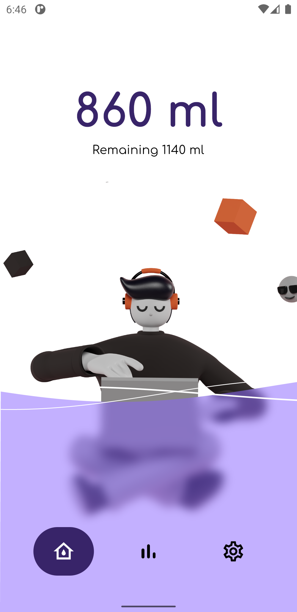
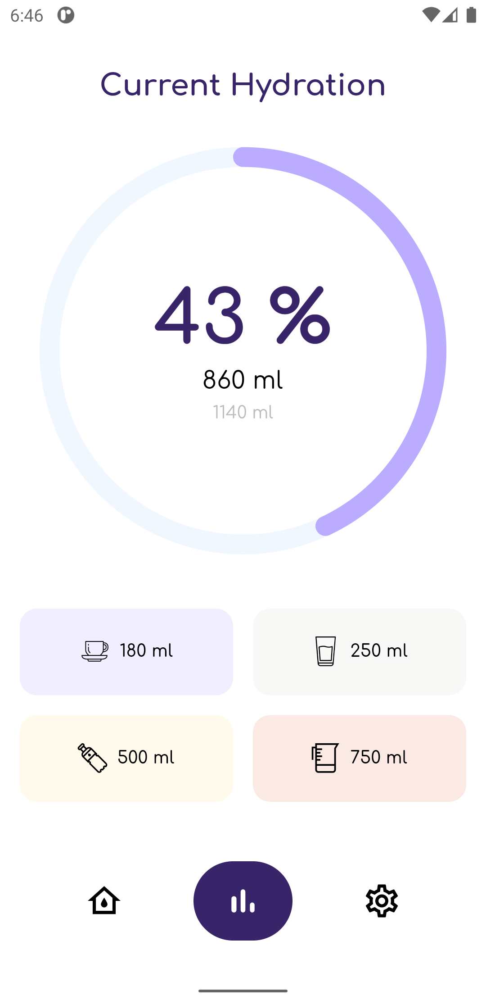
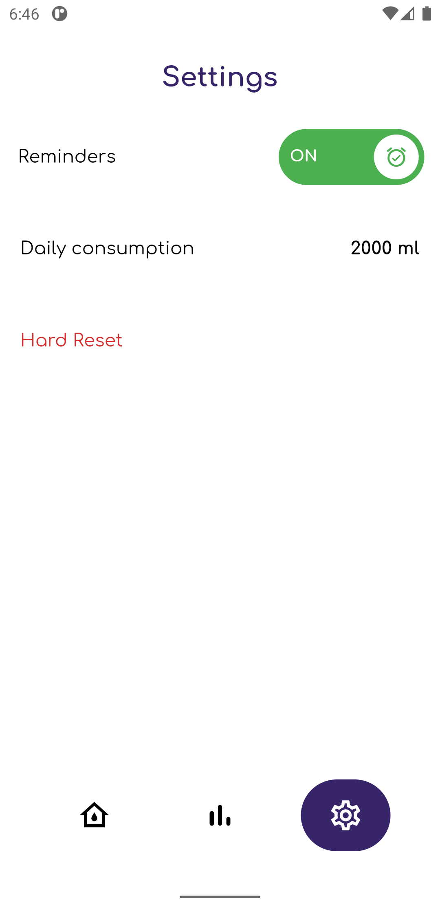
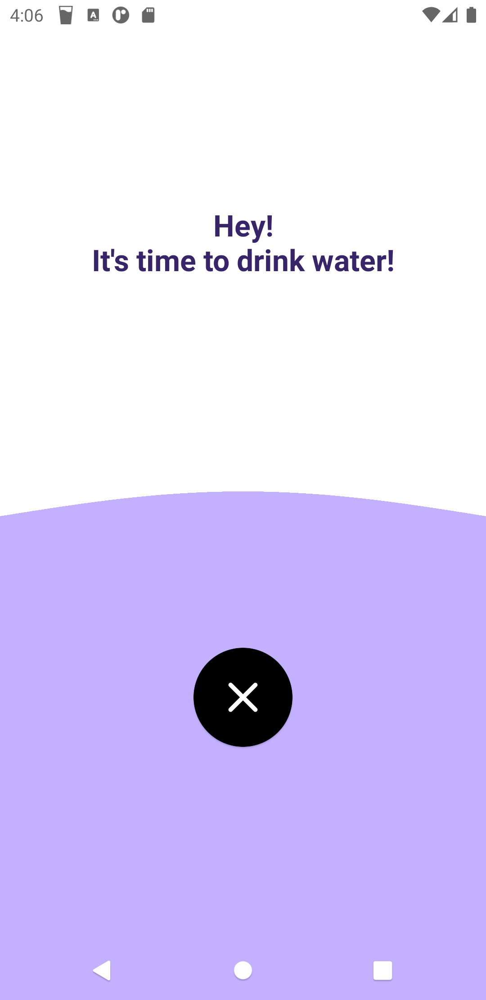

# Water Reminder App

Android water reminder App made with Flutter using Android APIs such as DataStore and AlarmManager.

Uses a native activity which is displayed when an alarm notification is triggered and the device is locked.

## Features
- Flutter UI: Advanced UI and animations.
- DataStore: To store data asynchronously using Kotlin coroutines and Flow.
- AlarmManager: Schedule repeating alarms display notifications (also full screen notification on lock screen).

## Screenshots
|  |  |  |  |
|----------|:-------------:|:-------------:|:-------------:|